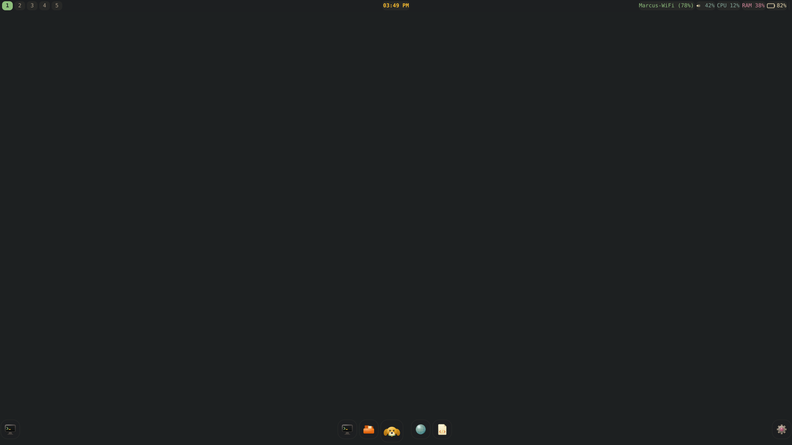
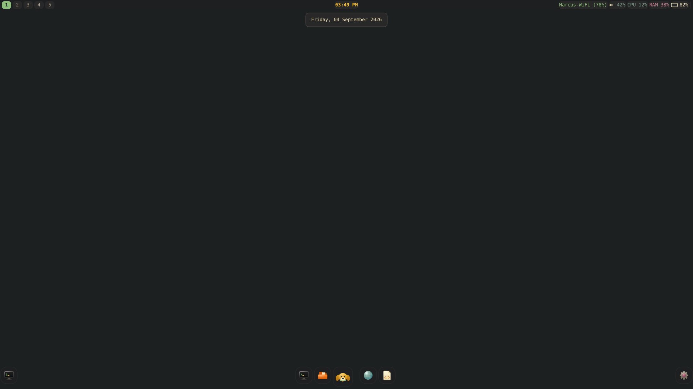
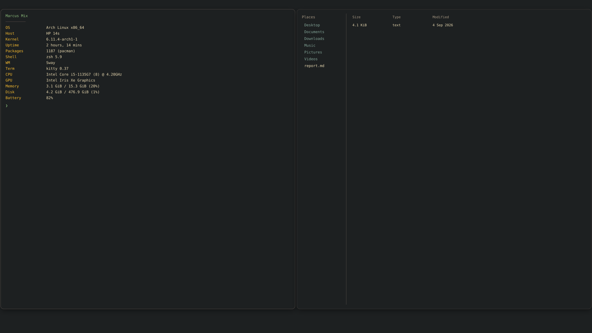
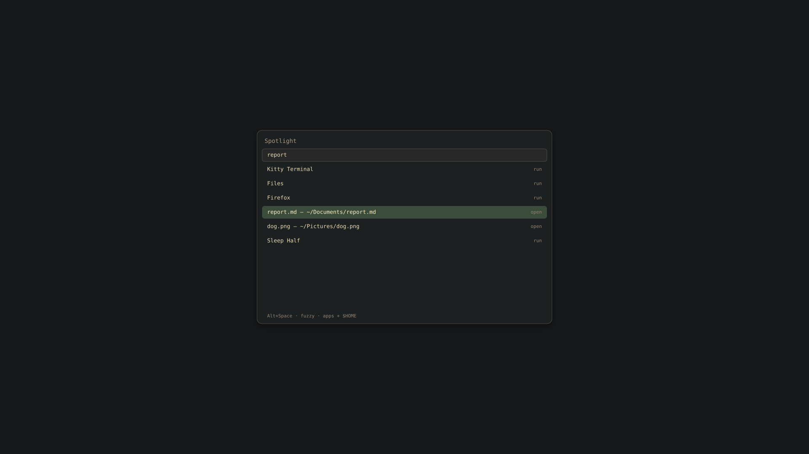

# Peach-GUI-Marcus — the "Marcus Mix" desktop as an Archiso profile

Marcus Mix is a custom Sway + waybar desktop for an HP 14s, packaged as a
buildable Arch Linux live/installer ISO. This repository is the **whole build**:
the archiso profile (`profiledef.sh`, `pacman.conf`, `packages.x86_64`,
`airootfs/`), the desktop config under `airootfs/root/.config/`, the build
scripts, a test suite, a post-quantum audit, and rendered previews of the UI.

> **Current branch:** `arena/01a06bbe-peach-gui-marcus` (built on `main` @
> `8b38c03`). The audit of both this branch and the remote-only
> `arena/019f7c2f` branch is in
> [`docs/AUDIT-2026-09-04.md`](docs/AUDIT-2026-09-04.md).

## An honest note on "screenshots"

Taking a real screenshot needs a booted ISO — a Wayland socket, a compositor and
`wlr-screencopy` — which this sandbox does not have. So this README shows two
things, clearly separated:

1. **Rendered previews** in `docs/previews/` (below). These are *not*
   screenshots: they are generated by `tools/render-preview.mjs`, which reads this
   repo's own `waybar/config`, `waybar/dock.jsonc`, `style.css`, `dock.css`,
   `sway/config` and the real MarcusMix SVG icons, and lays them out with the
   values those files contain. The layout, colours, sizes and icons are faithful;
   the Font Awesome status glyphs and JetBrains Mono are stand-ins because those
   fonts aren't installed on the renderer's machine.
2. **Real screenshots** go in `docs/screenshots/`. Run
   `scripts/capture-screenshots.sh` from inside a booted Marcus Mix session and
   it writes exactly the filenames this README would link to.

## Preview



*The desktop as it sits: waybar top bar and the dock.*

| | |
|---|---|
|  | Clock pinned to **Asia/Kolkata**; tooltip reads e.g. **4 September 2026** |
|  | Two tiled windows: `kitty` running `fastfetch` (live hardware query) and the file manager |
|  | `Alt+Space` Spotlight: fuzzy search over apps + `$HOME` |

## What ships (the package inventory)

Grouped as in `packages.x86_64`; every entry is justified by something a user can
see or run, and the manifest comments record why each is present so it cannot be
trimmed again by mistake.

| Group | Packages |
|---|---|
| Base & kernel | `base` `linux` `linux-firmware` `intel-ucode` `sof-firmware` `mkinitcpio` `mkinitcpio-archiso` |
| GPU / rendering | `mesa` `vulkan-icd-loader` `vulkan-intel` `intel-media-driver` `vulkan-tools` (vkcube = the "is Wayland GPU-accelerated?" check) |
| Filesystems | `btrfs-progs` `e2fsprogs` `exfatprogs` `ntfs-3g` `dosfstools` `lvm2` `cryptsetup` |
| Install toolchain | `arch-install-scripts` `archinstall` `parted` `gptfdisk` `grub` `efibootmgr` `syslinux` |
| Networking | `dhcpcd` `iwd` `iw` `wpa_supplicant` `wireless-regdb` `bind` `openssh` `rsync` `reflector` |
| BT / print / scan | `bluez` `bluez-utils` `cups` `sane` |
| Power / memory / sched | `power-profiles-daemon` `zram_generator` (+ `airootfs/etc/systemd/zram-generator.conf`) `ananicy-cpp` `earlyoom` |
| Sandboxing | `flatpak` |
| Dev basics | `git` `base-devel` |
| Core utilities | `sudo` `vim` `neovim` `nano` `mc` `less` `diffutils` `man-db` `man-pages` `usbutils` `smartmontools` `dmidecode` `pv` `tmux` `screen` `fastfetch` `zsh` `grml-zsh-config` `plocate` `jq` |
| Desktop | `sway` `swaybg` `swaylock` `swayidle` `waybar` `wofi` `mako` `kitty` `kitty-terminfo` `xdg-desktop-portal` `xdg-desktop-portal-wlr` `polkit-gnome` `xdg-utils` `gvfs` `xdg-user-dirs` `libnotify` `brightnessctl` `grim` `slurp` |
| Dock apps | `firefox` `pcmanfm` |
| Audio (PipeWire) | `pipewire` `pipewire-alsa` `pipewire-pulse` `wireplumber` `alsa-utils` |
| Fonts | `ttf-jetbrains-mono` `ttf-dejavu` `ttf-font-awesome` `noto-fonts` `noto-fonts-emoji` `terminus-font` `wl-clipboard` `cliphist` `playerctl` |

**The SwayFX caveat.** `packages.x86_64` installs *vanilla* sway. The rounded
corners / blur / shadows in `sway/config` are SwayFX-only, and SwayFX is
AUR-only, which archiso cannot install from a profile. On the ISO they are inert;
run `scripts/install-swayfx.sh` on the target to get them. `perf-profile.sh`
detects which compositor is running and writes `~/.config/sway/effects.conf`
accordingly, so vanilla sway does not log "Unknown/invalid command" for each
effect line.

## Timezone and date

* System and session are **Asia/Kolkata (IST)** — via `/etc/localtime`, a
  `TZ=Asia/Kolkata` export in `.zprofile`, and a `"timezone"` override in waybar.
* The clock shows a 12-hour time; the tooltip uses **Day Month Year**, e.g.
  **4 September 2026**. All dates in this README and the docs use the same form.

## Performance and refresh rate

`airootfs/root/.config/sway/scripts/perf-profile.sh` tunes sway for the panel it
is actually running on, instead of hard-coding one number:

* **Render latency** — `output <name> max_render_time` is computed per output as
  `round(1000/Hz − 4ms)`, clamped to `[1,16]`: 60 Hz→13 ms, 90→7, 120→4,
  144→3, 240→1, 30→16. Lower latency without missing vblanks, on every refresh
  rate including high-refresh (90/120/144 Hz) displays.
* **Quality tier** — a pixel-throughput score `Σ(w·h·Hz)` picks a blur/shadow
  tier (high on the target 1080p laptop = today's look; progressively lighter for
  4K / multi-monitor / high-Hz / battery / software rendering). It only ever
  *reduces* cost on hardware that can't afford it; the UI on the target machine is
  unchanged.
* **Idempotent** — a reload that changes nothing issues no `swaymsg` at all, so
  there is no output-reconfigure flicker.

These numbers are asserted by `tests/test_perf_profile.py` against a stubbed
swaymsg. **Actual sustained FPS cannot be measured here** (no GPU/Compositor);
that needs the ISO on hardware, which the VM/hardware run in §Build closes.

## Security

* **No credential in the repo.** The hardcoded root password is gone; the retired
  string appears nowhere. `tests/test_configs.py` fails if any inline credential
  returns. To bake a real root password, run
  `scripts/set-root-password.sh` (it writes a SHA-512 hash to a git-ignored file
  that `customize_airootfs.sh` consumes and deletes during the build). With no
  hash, the image boots with no root password — upstream archiso's live default.
* `spotlight.sh` builds its home index with mode 600 (it indexes files regardless
  of directory permissions, so the database must not be world-readable).
* `scripts/pqc-audit` audits the machine's real post-quantum posture; see
  [`docs/PQC-THREAT-MODEL.md`](docs/PQC-THREAT-MODEL.md).

## Structure

```
├── profiledef.sh            archiso metadata + file permissions
├── pacman.conf              repos (multilib enabled for Wine/Steam later)
├── packages.x86_64          the manifest (§What ships)
├── bootstrap_packages       archiso bootstrap (base, arch-install-scripts)
├── airootfs/
│   ├── etc/systemd/zram-generator.conf   makes zram actually exist
│   └── root/
│       ├── .zprofile        env for clients, TZ, VM/pixman switch, exec sway
│       ├── .zlogin / .zshrc.local
│       ├── customize_airootfs.sh  build-time setup (no credential)
│       └── .config/{sway,waybar,mako,fastfetch,gtk-3.0,gtk-4.0}/
├── scripts/
│   ├── build-test-iso.sh    builds a VM-test ISO without touching the work tree
│   ├── vm-test.x86_64       VM guest agents merged only for test builds
│   ├── capture-screenshots.sh  real screenshots on a booted session
│   ├── install-swayfx.sh    post-install SwayFX from the AUR
│   ├── set-root-password.sh git-ignored build-time root hash
│   └── pqc-audit            post-quantum posture scanner
├── tests/                   63-test suite, no dependencies (run-tests.sh)
├── tools/render-preview.mjs builds docs/previews/*.png (optional)
└── docs/  AUDIT-*, PQC-THREAT-MODEL.md, previews/, screenshots/ (real, on target)
```

## Test the UI right now (Arch box/VM, no ISO, no merge)

The ISO is only a delivery mechanism — the desktop is Sway + config files, so on
an existing Arch Linux system (e.g. your KDE VM) you can launch it directly from
this checkout. **You must have the repo cloned on that machine first** — running
`git fetch`/`checkout` from your home directory fails with "not a git
repository":

    cd ~
    git clone https://github.com/anacondy/Peach-GUI-Marcus.git
    cd Peach-GUI-Marcus
    git checkout arena/01a06bbe-peach-gui-marcus
    ./scripts/deploy-to-arch.sh                      # dry run: shows the plan
    ./scripts/deploy-to-arch.sh --apply --packages   # deploy configs+icons, install deps

Then switch to a free TTY (`Ctrl+Alt+F3`), log in, and run
`export WLR_RENDERER=pixman && exec sway` (VMs usually lack a real GPU for
wlroots; pixman is the software renderer). If your KDE session is X11 you can run
it in a window instead: `WLR_BACKENDS=x11 sway`. Inside: `Alt+Space` Spotlight,
`Super+Return` kitty, `Print` screenshot. `grim ~/marcus.png` then copy it into
`docs/screenshots/` to turn a preview slot into a real screenshot.
`scripts/deploy-to-arch.sh --revert` undoes everything. VS Code is not required
to run it — it's only useful for browsing/editing the branch (e.g. via Remote-SSH
into the VM).

Blur/rounded corners won't appear in a VM (vanilla sway + pixman); install SwayFX
on real hardware via `scripts/install-swayfx.sh` for those.

## Build & test

1. On an Arch host with `archiso`: `sudo pacman -S archiso`.
2. `./scripts/build-test-iso.sh` — stages a copy of the profile, merges
   `vm-test.x86_64` for a VM run, builds into `out/`. The work tree is never
   modified (asserted by the test suite).
3. Boot the ISO in a VM: `VM` is detected and sway uses `pixman` (no blur/shadows
   by design). Verify dock icons launch, `Alt+Space` opens Spotlight, terminals
   run `fastfetch`.
4. For real SwayFX visuals and FPS validation, flash to USB and boot the HP 14s,
   run `scripts/install-swayfx.sh`, then `scripts/capture-screenshots.sh`.
5. Run the suite anywhere: `./tests/run-tests.sh`.

## What this environment proved vs. what still needs hardware

* **Proved here (ran):** build script stages a valid profile and leaves the tree
  untouched; every config/module/font/icon/package/file referenced actually
  exists; refresh-rate latency and tier math is correct and clamped; the
  launcher assembles, caches and dispatches; no credential is committed;
  pqc-audit runs and degrades gracefully. 63/63 tests green.
* **Needs hardware:** booting, rendering, SwayFX effects, sustained FPS at any
  refresh rate, and the real screenshots.

See [`docs/AUDIT-2026-09-04.md`](docs/AUDIT-2026-09-04.md) for the full,
evidence-tagged finding list.
